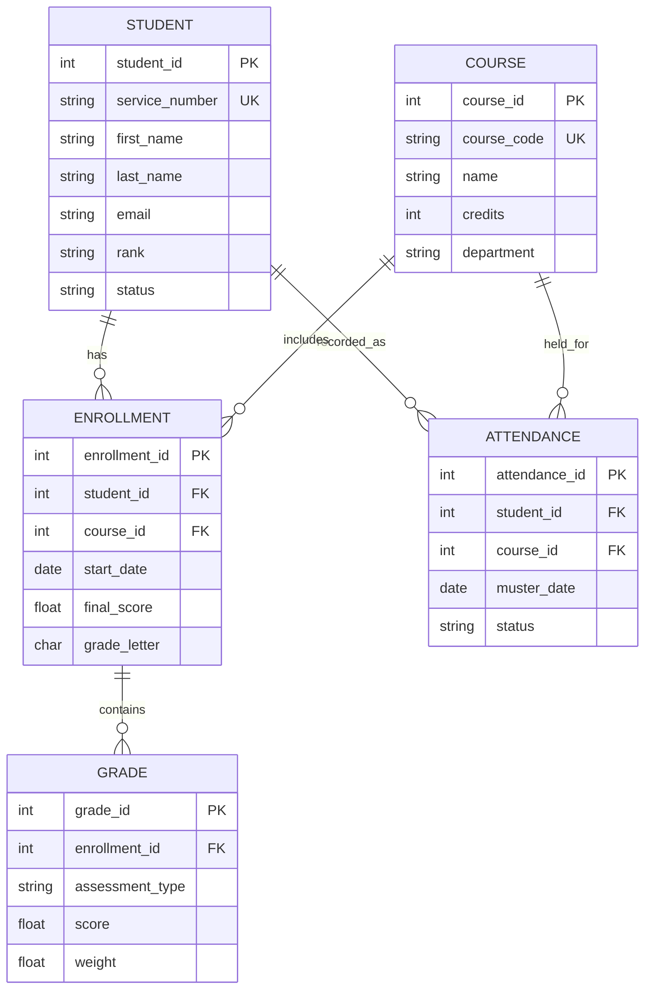

# Business Requirements Document
## Elite Defense Academy — Student Records Management System (SRMS)

This document outlines the core business requirements and technical schema design for the Elite Defense Academy SRMS.

---

## 1. Key Business Requirements

The system handles five core entities to manage the cadet lifecycle:

### 1.1 Students (Cadets)
- **Purpose**: Maintain official personnel records for all trainees.
- **Attributes**: Service Number (Unique), First Name, Last Name, Email, Rank, Status (Active, Graduated, etc.).

### 1.2 Courses (Modules)
- **Purpose**: Define the training curriculum catalog.
- **Attributes**: Course Code (Unique), Name, Credits, Department, Difficulty Level.

### 1.3 Enrollments (Service Records)
- **Purpose**: Link students to courses they are currently taking or have completed.
- **Attributes**: Student ID, Course ID, Start Date, Completion Date, Final Score, Grade Letter.

### 1.4 Grades (Evaluations)
- **Purpose**: Capture specific assessment results (exams, practicals) within an enrollment.
- **Attributes**: Enrollment ID, Assessment Type, Raw Score, Weight factor.

### 1.5 Attendance (Muster Rolls)
- **Purpose**: Track daily presence for accountability and discipline.
- **Attributes**: Student ID, Course ID, Date, Status (Present, Absent, Late, AWOL).

---

## 2. Entity-Relationship Diagram (ERD)

<!-- [ERD_SVG_PLACEHOLDER] -->
<!-- Please add your exported SVG file here for a high-quality visual representation. -->

---

## 3. Database Schema & Normalization

### 3.1 3rd Normal Form (3NF) Compliance
The database schema is designed to adhere to **3rd Normal Form (3NF)** to ensure data integrity and reduce redundancy:

1.  **1NF**: All attributes are atomic; no repeating groups.
2.  **2NF**: All non-key attributes are fully functional dependent on the primary key.
3.  **3NF**: No transitive dependencies (all non-key attributes depend *only* on the primary key).

### 3.2 Detailed Key Definitions

| Table | Primary Key (PK) | Foreign Key (FK) | Reference / Parent Table |
| :--- | :--- | :--- | :--- |
| **STUDENTS** | `student_id` | - | - |
| **COURSES** | `course_id` | - | - |
| **ENROLLMENTS** | `enrollment_id` | `student_id` `course_id` | **STUDENTS** (`student_id`)   **COURSES** (`course_id`) |
| **GRADES** | `grade_id` | `enrollment_id` | **ENROLLMENTS** (`enrollment_id`) |
| **ATTENDANCE** | `attendance_id` | `student_id` `course_id` | **STUDENTS** (`student_id`)   **COURSES** (`course_id`) |

#### Key Logic & Rationale
- **Primary Keys**: Every table uses a surrogate integer `PK` (e.g., `student_id`) for internal indexing and performance. Business identifiers like `service_number` or `course_code` are maintained as **Unique Keys (UK)**.
- **Foreign Keys**:
  - `ENROLLMENTS`: Links a specific student to a specific course.
  - `GRADES`: Evaluates performance tied directly to an enrollment record (ensuring grades can't exist without an enrollment).
  - `ATTENDANCE`: Tracks daily records for a student within a specific course context.

---

## 4. Data Integrity & Constraints

To ensure the reliability of the data, the following rules are enforced:

| Rule Category | Description |
| :--- | :--- |
| **Entity Integrity** | Every table must have a Primary Key; PKs cannot be NULL. |
| **Referential Integrity** | Foreign keys must point to valid primary keys in the parent table. |
| **Domain Integrity** | Data types and constraints (e.g., Scores must be 0-100, Grade must be A-F). |
| **Unique Constraints** | Service numbers, course codes, and emails must be unique across the system. |
| **Check Constraints** | Completion Date must be ≥ Start Date; Attendance Rate must be 0-100%. |